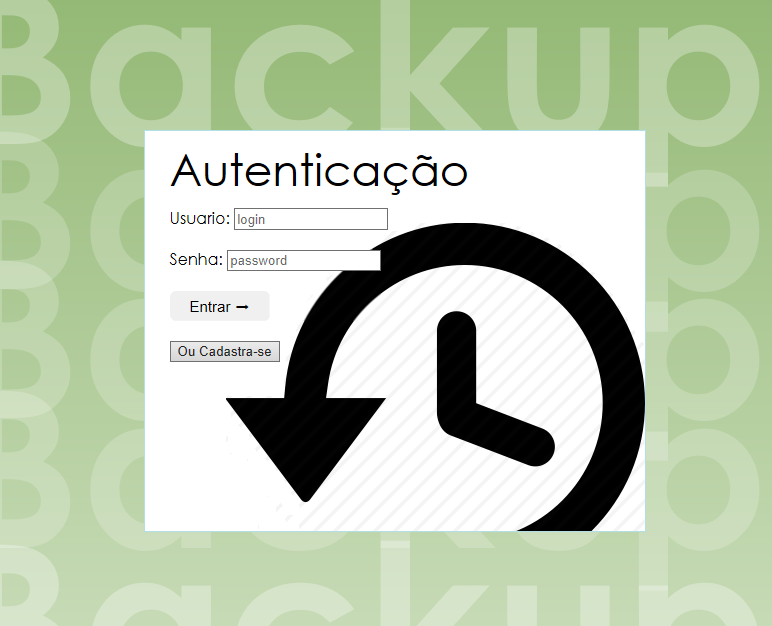
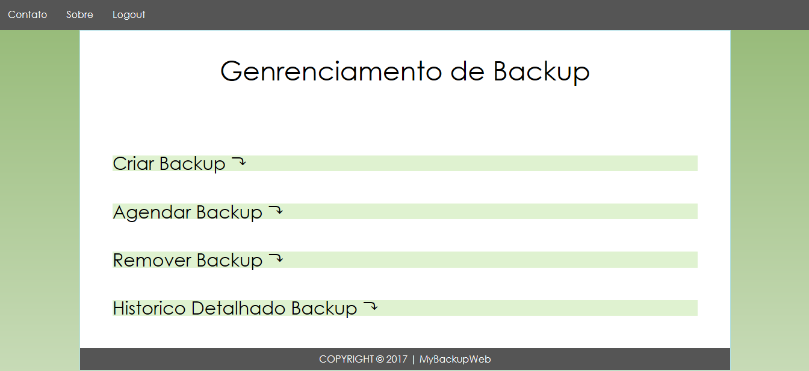

# MyBackupWeb

## Descrição

Backup é um termo inglês que tem o significado de cópia de segurança.

Esse projeto tem como objetivo a realização de backups promovendo a segurança dos arquivos selecionados. Se, por qualquer motivo, houver perda dos arquivos originais, a cópia de segurança armazenada pode ser restaurada para repor os dados perdidos.  

O backup é muito valorizado por quem já perdeu informações importantes e não teve possibilidade de as recuperar. Portanto, é um procedimento altamente recomendável devido a frequência com que se perde informação digital.

Este website oferece gratuitamente a oportunidade de gerenciar backups dos seus dados de forma simples em seu sistema operacional (SO) distribuição Linux.

## Objetivos

Processo de realização do backup deverá ser realizado por usuário devidamente cadastrado e com processo de autenticação.
Entre as tarefas de gerenciamento do backup estão as seguintes rotinas:

 ### Criar backup automático:
  * Selecionar o tipo do backup: 
    * Sistema;
    * Diretório específico;
  * Especificar local de armazenamento do backup:
    * Caso não especificado o local de armazenamento, o backup será realizado em diretório default.

### Criar backup através do processo de agendamento:
 * Rotinas conforme backup automático:
   * O agendamento poderá ser realizado da seguinte formas:
    * Diariamente;
    * Semanalmente;
    * Mensalmente.

### Remover backup:
 * Excluir backup:
   * Para excluir o backup desejado, será apresetado uma lista de todos os backups salvos.

### Apresentar histórico dos backups:
 * Apresentar uma lista de backups já realizados através de uma lista.

### Recuperar backups:
 * Recuperação do backup selecionado.

## Inspiração

**Bacula**

Bacula é um conjunto de programas de computador, que permite ao administrador de sistema gerenciar processos de backup, recuperar e verificar dados informáticos através de uma rede de computadores de diferentes tipos.

* Características
  * Compatível com SOs Linux, Unix, Mac e Windows;
  * Verificação e gerenciamento dos backups por monitor;
  * Apresentação detalhado do status e informações adicionais dos backups.

Mais informações: http://www.kitploit.com/2015/05/bacula-network-backup-tool-for-linux.html

**Veeam® Endpoint Backup**

Oferece uma solução simples para fazer backup de desktops e laptops baseados no Windows.

* Características
  * Versão gratuita;
  * Notificações por e-mail;
  * Backup completo autônomo;
  * Ajuste do mecanismo de backup.

Mais informações: https://www.veeam.com/br/endpoint-backup-free.html

*Figura 1 - Layout da página*

## Protótipos

*Figura 2 - Cadastro de usuário*

*Figura 3 - Gerenciamento de backups*

## Comandos
Alguns exemplos de comandos para ações específicas do código

## Instalação
